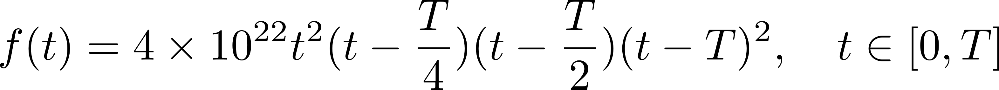
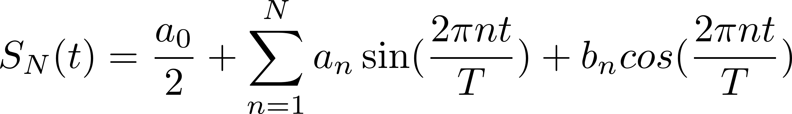
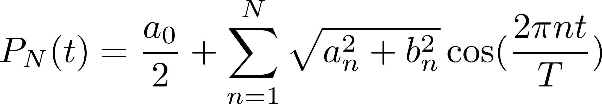
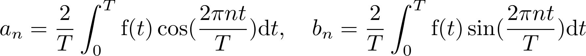
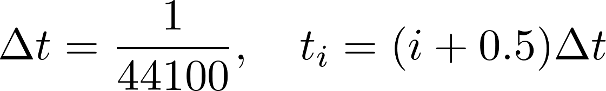

# Speech Signal Lab2

## About this Lab
Given the periodic function f(t) with period = T such that
> 

 where, in this case, period T = 1/440.

What we're going to do is to generate the sounds, with file format `.wav`, of function f(t) and the functions
>   
>   
> where  
> 

 with the help of library `wavfile.h`,
 and see how the value of N we choose
 can alter the way the last two functions
 sound like comparing to the original function f(t).

 The reason we also take function P\_N(t) into account instead of comparing only f(t) and S\_N(t) is that we (,or, I'd rather say, our teacher of the class,) assume that **human acoustic apparatus can't distinguish
  the two sounds generated by S\_N(t) and P\_N(t)**

## Build and Run
### Requirement
* C compilers that support C11 or later.  
 For instance, the latest version of `clang` or `gcc`.
* `Cygwin` is recommended for Windows7+ users.

### Build and Run
The following instructions are carried out based on `Bash`:  

1.  Clone or Download the [repository](https://github.com/MonkeyChuang/SpeechSignal_lab2.git).  
1.  Run `make` to compile and link the source and header files   
```bash
$make
```   
1.  Run the executable file `analy_sound`, and it will ask you
	to provide an input for `nMax`, you can see what this variable stands for in the next section.   
```bash
$./analy_sound  
provide an input for nMax > 0 (1~50 is recommend) : 10
```  
1.  After execution, four files will be generated to your 
	current working directory. We can see them using command `ls`  
```bash
$ls   
sample_sound.c	wavfile.c			wavfile.h		analy_sound    
sound_o.wav		sound_n1.wav		sound_n2.wav		coef.txt   
```
1. (Optional) After finishing these procedure, you can execute
`make clean` to remove all `.o` files and executable `analy_sound`   
```bash
$make clean
rm analy_sound *.o
```

## Some Variables You Need to Know
|Variable Name|value|Meaning|	 
|:------------|:---:|------:|
|rate|44100|Sample Rate|
|T|1/440|Period T|
|totalTime|5|Total Time|
|nMax|(defined by user)|N|
## Output files
The following `.wav` files are created with sample rate 44100 Hz. Each sounds' total time is 5 seconds. 
### sound_o.wav
Sound file that is created with sound data f(t).  
### sound_n1.wav
Sound file that is created with sound data S\_N(t).  
### sound_n2.wav
Sound file that is created with sound data P\_N(t).  

### coef.txt
Text file that contains first N Fourier coefficients of
function f(t) and other informations necessary for us to 
recover f(t) by means of evaluating partial sum of Fourier series of f(t):
>   

This formula reveals the content of those important informations:

*  Sample Rate
*  Period
*  Total Time
*  N  

Variable name and its value(if assigned) of each information is listed inside the following paratheses.   
Usage of this data will be updated sometime in the future.

## Implementations of functions
### double fun(x)
Return the value of function f(t) at t=x.
### double** DFT_fun(T,length,nMax)
This function evaluate the first nMax Fourier coefficients of the function f(t).  
The Integral is estimated by Riemann Sum, that is  
>   
>   

---
created by [MonkeyChuang](https://github.com/MonkeyChuang)